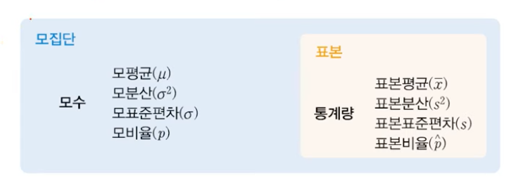

## 1. 모집단과 표본추출

#### 모집단
- 모집단(population) : 통계분석 방법을 적용할 관심 대상의 전체 집합

#### 표본
- 표본(sample) : 과학적인 절차를 적용하여 모집단을 대표할 수 있는 일부를 추출하여 직접적인 조사 대상이 된 모집단의 일부

#### 모수
- 모수(parameter) : 모집단을 분석하여 얻어지는 결과 수치
- ex. 모평균, 모분산, 모표준편차, 모비율

#### 통계량
- 통계량(statistic) : 표본을 분석하여 얻어지는 결과 수치
- ex. 표본평균, 표본분산, 표본표준편차, 표본비율

#### 표본추출
- 확률적 표본추출 방법 (probability sampling method)
  - 표본추출의 방법은 동일한 확률 하에서 표본을 구성

- 비확률적 표본추출 방법 (non-probability sampling method)
  - 확률과는 상관없이 조사자가 자신의 의지로 표본을 뽑거나 조사 대상이 자발적으로 표본을 구성

#### 확률적 표본추출
- 단순 무작위 표본추출
  - 모집단에서 일정한 규칙에 따라 기계적으로 추출 => ex. 컴퓨터를 돌려서 추출, 난수 표 사용
  - 과학적인지 의문이지만, but 확률적 표본추출은 확률적으로 모두 동일한 방법을 추출하는 것이기에 단순 무작위 표본추출 방법 역시 확률적 표본추출에 속한다.
- 체계적 표본추출
  - 전체적인 모집단 100개로 구성되어 있을 때, 10%에 해당하는 표본추출 => 1, 11, 21, 31, ... 91번 을 각각 뽑았을 때 (표본으로 구성될 확률이 모두 동일)
- 비례 층화 표본추출
  - 모집단을 여러 개의 집단으로 나눈다. => 규칙에 의해 구분됨
  - A대학교의 학생 1학년, 2학년, 3학년, 4학년 각각의 비율이 1:2:3:4 으로 되어있을 때, 학교 전체 모집단은 10,000명 
  - 10,000명 중에서 10%를 뽑으려고 할 때? 
    - 1:2:3:4 => 100 + 200 + 300 + 400 = 1,000 명
- 다단계 층화 표본추출
  - 학교를 기준으로 1, 2, 3, 4학년을 기준으로 나누었을 때, 단과대별로 한 번 더 나눈다.
  - 기준이 학년별로 나누고, 단과대로 나누었으니 다단계의 기준 적용되었음
  - 비례 층화 보다 조금 더 과학적인 방법
- 군집 표본추출
  - 모집단이 구성되어 있을 때, 모집단의 구성이 내부는 이질적이면서 외부는 동질적으로 구성되어 있을 때 => 일부분의 군집만을 추출한다.
  - 서울 25개구 => 외부적으로는 동질적(구)이지만, 내부적인 각각의 구 안에서는 이질적이다.

#### 비확률적표본추출
- 편의 표본추출
  - 조사자의 마음대로 추출해서 표본으로 삼는 것.
  - 장점 : 비용이 적게들고 편리하다.
  - 단점 : 실수, 오류 가장 많이 발생 + 과학적이지 않다.
- 판단 표본추출
  - 조사자가 생각을 한 번 더 하는 것.
  - 적합하다고 판단이 되는 표본을 추출
- 할당 표본추출
  - 모집단의 속성을 대표할만한 연령, 학력, 직업 등을 구분
  - 각각의 표본을 갯수를 결정
  - 조사자가 임의적으로 할당 
    - ex. 연령에 대해서는 몇명, 학력에 대해서는 몇명 ,...
- 자발적 표본추출
  - 조사자는 가만히 있고, 표본이 되는 것들이 자발적인 것
  - 조사에 관심이 있는 사람들만 자발적일 확률이 크기 때문에, 결론적으로 결과가 왜곡이 될 가능성이 제일 크다.