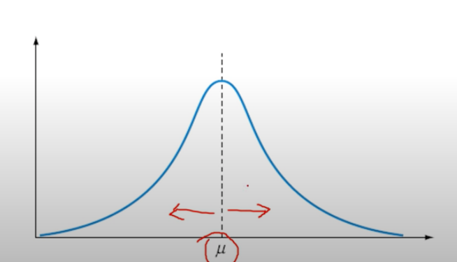
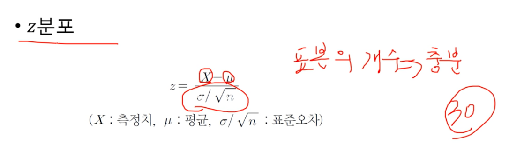
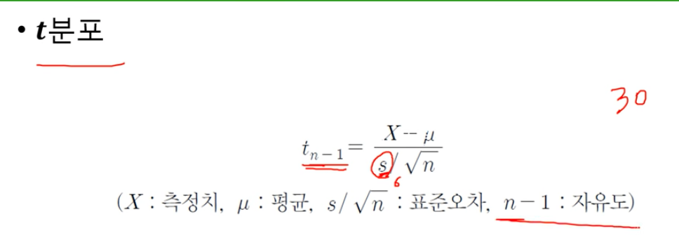
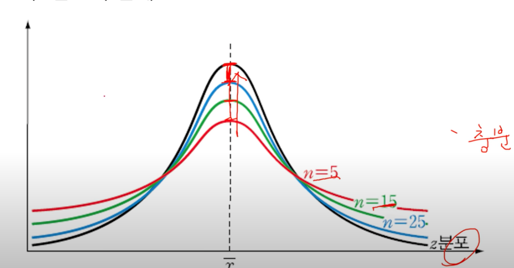
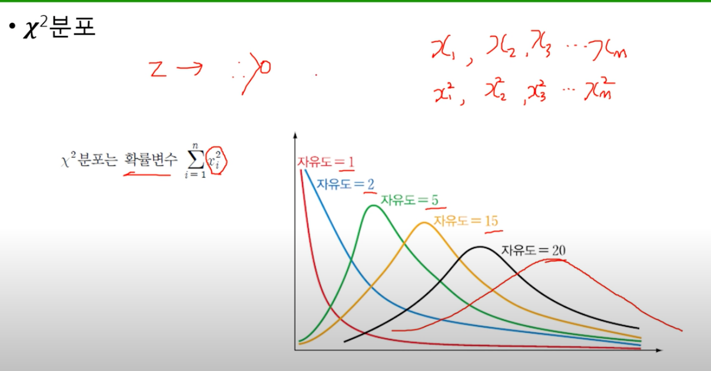
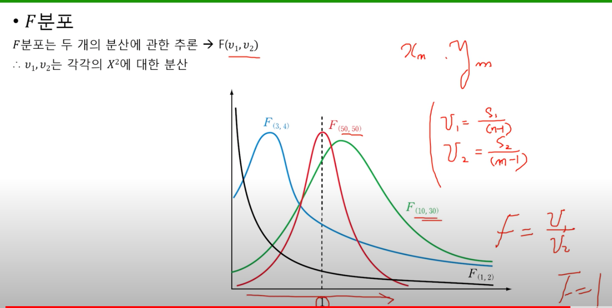

# 2. 표본의 분포

## 정규분포
- 표본분포 중 가장 단순하면서도 많이 나타나는 형태의 분포
- 어떤 사건이 일어난 빈도(frequency)를 계산하여 그래프로 나타내면 중심(평균)을 기준으로 좌우가 대칭되는 분포

## 표준화
- 단순화 현상은 정규분포만을 이용해도 결과를 알아내는 데 문제가 없지만, 대부분의 연구에서는 복잡한 관계에 대한 분석 결과가 필요하므로, 여러 특성에 대한 분석 결과들을 서로 비교할 수 있도록 만드는 과정
  - 기준 : 평균 = 0, 분산 = 1, 표준편차 = 1
---
---

## z분포 (= 표준정규분포)
- 표본의 개수가 충분할 때 (30개를 기준) => 중심극한정리
- 모표준편차를 사용

---
---

## t분포
- 표본의 개수가 충분하지 못할 때 (30개를 기준) => 중심극한정리
- 표본표준편차를 사용
- 평균이 0, 분산이 1보다 큰 정규분포를 따른다.
- 자유도는 해당하는 측정히에서 1을 뺀, n-1

----
----

## z분포와 t분포의 관계
- z분포 : 표본의 개수가 충분
- t분포 : 표본의 개수가 충분하지 않음
- 표본의 개수가 늘어날 때 마다, 점점 그래프가 정규분포화 되어간다.

---
---

## 카이제곱분포
- 표준 정규분포로부터 도출된다
- z분포에 대한 제곱의 값을 분포로 나타낸 것
- 제곱 -> 0보다 큰 값
- 자유도가 n인 카이제곱분포를 구성
- 측정치가 늘어날수록 정규분포화가 된다.

---
---

## F분포
- 카이제곱분포에서는 1개의 확률 변수에 대해서만 측정했다면, F분포는 2개의 확률 변수에 대한 분산
- F분포는 각각의 분산의 비율
  - v1, v2의 자유도가 각각 50, 50이면 F분포의 비율은 "1"
    => 평균은 1을 기준으로 양쪽 대칭
---
---

## 표본비율에 대한 분포
- 표본비율분포는 모집단의 특성 중 모비율을 추정하기 위해 사용됨
- 주로 성공 vs 실패, 남성 vs 여성, 구매 vs 비구매 등 어느 한 사건이 발생하는 베리누이 시행의 이항분포를 활용하여 표본비율의 분포를 구한다.