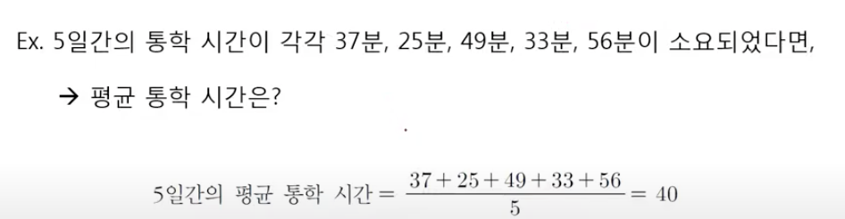
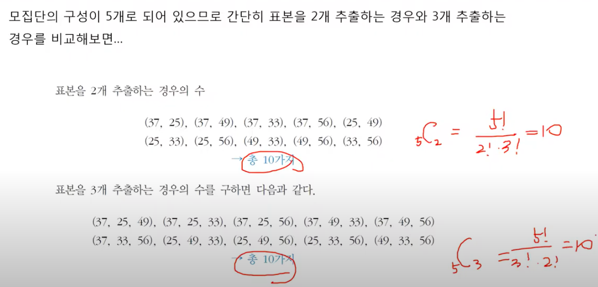
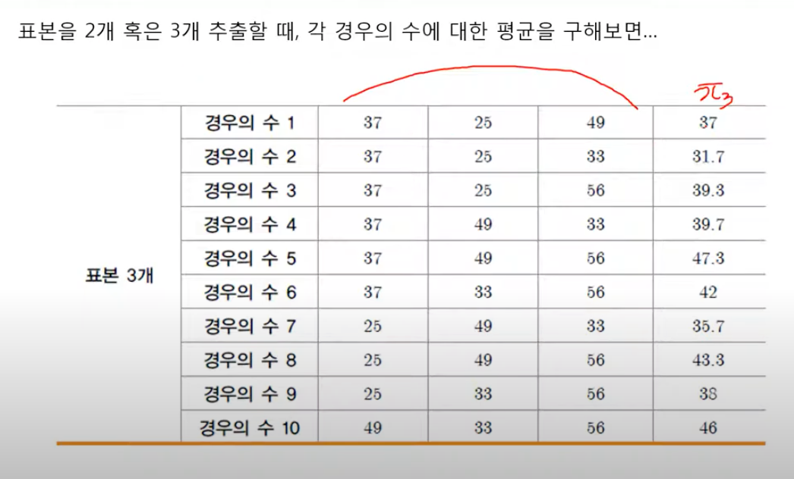
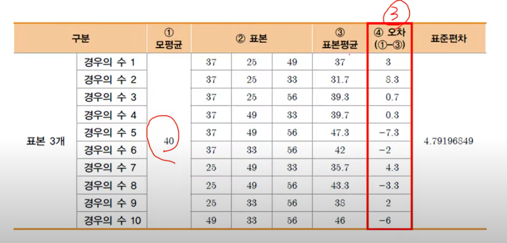
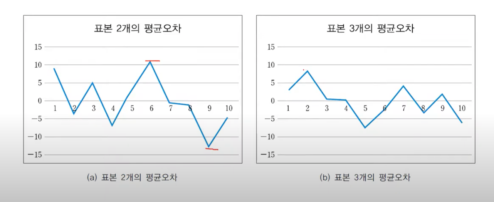
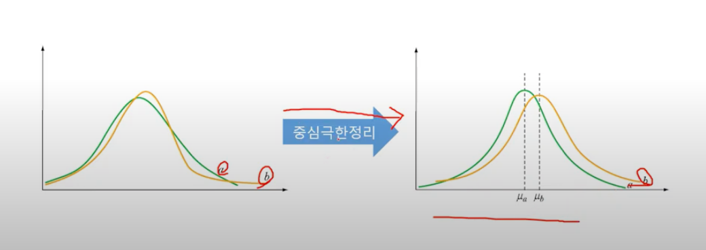

# 3. 표본분포와 중심극한정리

## 표본분포
- 표본분포 (sample distribution)는 표본에서 도출되는 통계량에 대한 확률분포
  - 표본분포는 모수를 측정하기 위한 표본 통계량의 확률 분포 (여러 번 측정)

- 평균오차는 2개보다 3개를 뽑았을 때 줄어드는 것을 그래프에서 확인할 수 있다.

---
---
# 중심극한정리
- 중심극한정리 (Central Limit Theorem: CLT)는 표본의 개수(n)가 충분하다면 모수를 모르는 상황에서도 표본 통계량으로 정규분포를 구성하여 모수를 추정할 수 있다는 것.

- 중심극한정리를 적용하면, b가 더 크다는 것을 확인할 수 있다.
- 중심극한정리때문에, 표본의 개수는 많으면 좋다
  - 많다는 기준은 30
  - but, 수학적으로 30개의 기준은 타당하지만 사회과학 기준에는 30개를 요구하는 경우는 없다 (변수가 많음)
  - 따라서 될수있으면 표본이 충분히 해야된다.