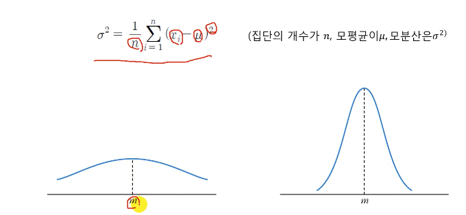
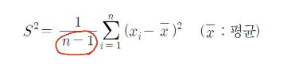

# 3. 중심경향도 (measure of central tendency)
- 데이터들을 종합하여 그 중심을 이루는 값이 어느 정도가 될지를 구한 것

## 평균
- 평균(mean)은 통계에서 가장 많이 활용되는 중심경향도
- 모든 통계분석에서 사용되며 표본의 특성을 제시할 때 가장 먼저 사용되는 수치

## 중간값
- 중간값(median)은 관측된 자료의 편중과는 상관없이 가장 작은 값에서 가장 큰 값까지 정렬했을 때 그 가운데 위치한 값
- 단점 : 양 극단의 값이 있을 때, 특성을 대표하기 힘들다.

## 최빈값
- 최빈값(mode)은 표본에서 가장 많이 나타나는 관측치
- 여러 번 확인된다는 특성으로 중심경향도에 있으나, 최소 부분과 최대 부분으로 쏠림 현상이 나타날 수도 있기 때문에 특별히 필요성이 없는 한 잘 사용되지 않음

## 산포도
- 중심경향만으로는 집단에 대한 성격과 분포를 파악하는데 부족하므로, 측정된 데이터가 어떻게 분포하고 있는지에 대해 파악해야 데이터를 제대로 이해할 수 있으며, 표본의 특성이라 할 수 있는 분포의 정도를 나타내는 산포도(dispersion)를 확인해야 한다.
- 변량들이 흩어져 있는 정도를 하나의 수로 나타낸 것을 산포도
- 어떤 값을 기준으로, 얼마만큼 흩어져있는지 나타낼 수 있는, 산포도 중 대표적으로 쓰이는 것이 "분산"
  - 어떤 값을 기준 ? => 평균을 기준
  - 어떤 집합의 변량들이 나타내는 대푯값(평균, 중앙값, 최빈값)을 기준
  - 얼마만큼 흩어져있는지 ? => 대푯값(평균)과 얼마만큼 떨어져있는지(거리가 얼마인지) 확인

## 모분산

- 모평균과 모집단의 개별 측정치들 간의 차를 구해서 제곱하여 모두 더한 후, 그 값을 다시 모집단을 구성하는 개수로 나누어 계산
- 분산(편차제곱의 평균)을 사용하는 이유?
  - 평균과 멀수록 가중치를 주기 위해서
  - 산포도의 최솟값이 평균이 되기 위해서 => 산포도에서 최솟값(가장 모여있을 때)은 평균에 모일 때
  - 미분불가능한 점이 없기 때문에
  - 유클리드 거리가 자주 이용되기 때문에

## 표본분산

- 모집단을 기준으로 하지 않고, 표본을 선정해서 표본의 개수 (n-1)로 계산한 분산을 표본분산(sample variance)이라 한다.
  - n-1 : 자유도 (df)
    - ex) A+B+C=10이 있을 때, A와 B의 수를 선정하면, C는 자동적으로 결정된다. 자유도를 가지는 것은 따라서 2개이다.
- 모집단을 이용하여 모수를 구하는 것은 불가능하다. 그렇기 때문에 표본을 사용한다
- 결과값은 모분

<https://velog.io/@peacecheejecake/%EC%A0%95%EA%B7%9C%EB%B6%84%ED%8F%AC%EC%9D%98-%ED%91%9C%EB%B3%B8%EB%B6%84%EC%82%B0-%EC%9C%A0%EB%8F%84>

## 표준편차
- 분산과 편차의 개념은 평균으로부터 측정치들이 어느 정도 흩어져 있는지의 정도를 나타내는 것이다. 다만 편차는 평균을 기준으로 음(-)과 양(+)으로 흩어져서 총합이 0이 되니, 이를 피하기 위해 편차를 제곱하는 것
- 분산값에 루트를 씌워 제곱근을 만들면 표준편차(standard deviation)를 계산