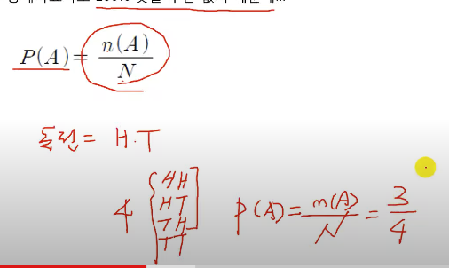
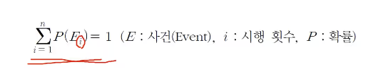
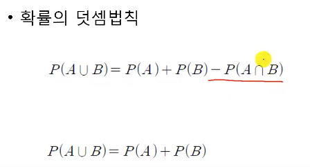
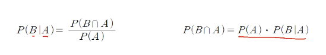

# 1. 확률과 의사결정

## 통계의 목적
- 모수를 추정
- 대표할만한 표본을 기준에서 통계량으로 모수를 추정

## 추정의 이유
- 1. 모집단을 대상으로 하는 조사가 불가능하거나
- 2. 시간과 비용 등의 물리적 한계 때문

## 확률
- 아무리 정교한 통계자료라도 100% 맞을 수는 없다

- 동전 앞면이 나올 확률은 4번 중, 3번 

## 확률이 가지는 조건

## 확률의 덧셈법칙

## 확률의 곱셈법칙

- P(B|A) : A가 발생한 다음, B가 발생할 확률