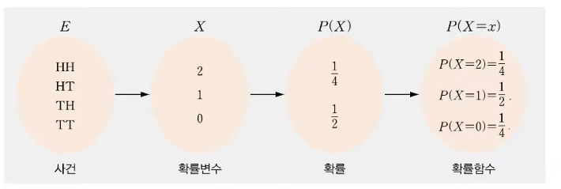
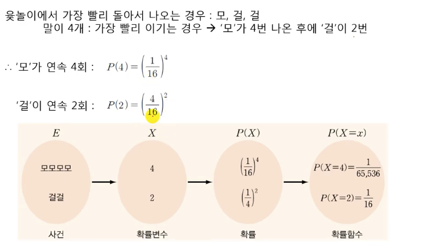

# 1. 확률과 의사결정

## 확률변수 (random variable)

## 확률함수 (probability function)

## 이산 확률변수(discrete random variable)
- 수집된 데이터의 확률변수 중 셀 수 있는 특정한 값들로 구성되거나 일정한 범위로 나타나는 확률변수

## 연속 확률변수(continuous random variable)
- 연속형이거나 무한한 경우와 같이 셀 수 없는 확률변수

