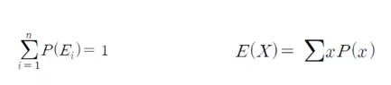
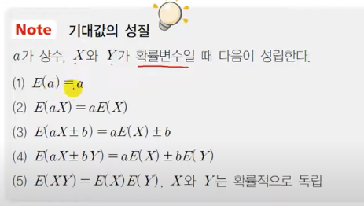
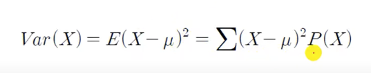

# 2. 확률변수의 기대값과 분산

## 기대값

- 사건에서 발생하는 해당 값과 그 사건이 발생할 확률을 곱해서 모두 더한 값

## 확률변수의 분산

- 기대값의 특성을 나타내는 값
  - 확률변수들이 기대값으로부터 벗어나는 정도

## 확률변수의 표준편차

- 분산의 제곱근

----

- A보다 B의 분산이 더 낮기 때문에, 더 안정적이다 (분산이 높다는 것은 불안정하다는 것.)
  - 따라서, 우승을 하기 위해서는 B를 영입해야 할 것.
